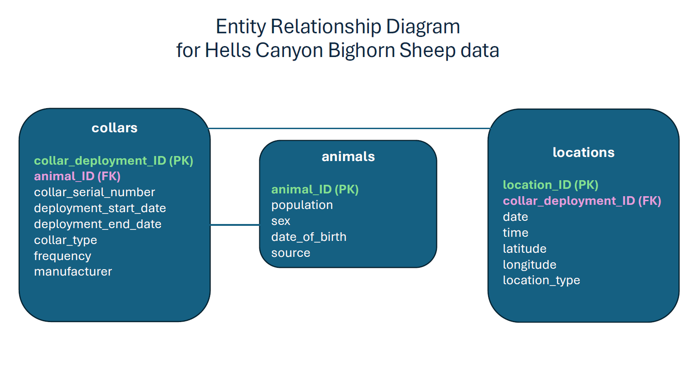

# Movement ecology of bighorn sheep in Hells Canyon

This multi-state model state assignment workflow is part of a larger PhD project investigating the movement ecology of bighorn sheep (*Ovis canadensis*) in the Hells Canyon region of Idaho, Washington and Oregon. The work is being carried out by Kristen Whyle under the supervision of Dr. Simona Picardi at the University of Idaho, and in collaboration with the Idaho department of Fish and Game, the Washington Department of Fish and Wildlife and the Oregon Department of Fish and Wildlife.


```{r fig.cap = "Bighorn sheep in Hells Canyon", fig.align='center', out.width='80%', echo = FALSE}

knitr::include_graphics("images/IMG_2685.JPG")

```

```{r fig.cap = "Hells Canyon landscape", fig.align='center', out.width='80%', echo = FALSE}

knitr::include_graphics("images/IMG_0968.JPG")

```


## Hells Canyon bighorn sheep

The Hells Canyon region of ID, OR, and WA is currently home to a metapopulation of bighorn sheep composed of several different populations (Figure 1.3). 

```{r import shapefile, include=FALSE}

# load packages ----
library(terra)
library(sf)
library(tidyverse)

# named paths for file directories ----

# input data file path
#ifp <- "input_data/"

# output data file path 
# (for processed/semi-processed data resulting from this script)
#ofp <- "output_data/"

# population ranges shapefile file path
#sfp <- "input_data/shapefiles/"

# figures file path
#ffp <- "figures/"
  
# import data ----

# load sheep location data:
# note this is all data partially cleaned;
# update with fully cleaned data when ready
nonsf_dat <- do.call("rbind", readRDS("input_data/trk8a_partially_cleaned_alldata_2024-08.rds"))

# load shapefile delineating population (aka herd) ranges:
# (note this is a manager defined shapefile and herd areas may not be precise
# we may update the shapefiles used in the future)
popn_ranges <- read_sf("input_data/shapefiles/HellsCanyonHerds.shp")

# harmonize population names ----

# rename popn_ranges NAME column to Population
colnames(popn_ranges)[5] <- "Population"

# update shapefile population names to match location data population names:
popn_ranges[which(popn_ranges$Population=="Lower Hells Canyon"),]$Population <- "LowerHellsCanyon"
popn_ranges[which(popn_ranges$Population=="Muir Creek"),]$Population <- "Muir"
popn_ranges[which(popn_ranges$Population=="Saddle Cr."),]$Population <- "Upper Saddle"
popn_ranges[which(popn_ranges$Population=="Lower Imnaha"),]$Population <- "Imnaha"
popn_ranges[which(popn_ranges$Population=="Upper Hells Canyon ID"),]$Population <- "UHC-ID"
popn_ranges[which(popn_ranges$Population=="Upper Hells Canyon OR"),]$Population <- "UHC-OR"

```


```{r fig.cap = "Hells Canyon Bighorn sheep populations", fig.align='center', out.width='100%', echo = FALSE}

# plot the herd range shapefile ----
plot(popn_ranges[5], main = "Hells Canyon Bighorn Sheep Populations")

```

Bighorn sheep are native to Hells Canyon but were extirpated by 1945, likely due to a combination of overharvesting and competition and disease introduced from livestock. Reintroductions began in 1971 and the metapopulation has been monitored ever since, including by collecting data on their movements by VHF/GPS collaring individuals (Figure 1.4). The first VHF data was collected in 1997 and the first GPS data was collected in 2005 and both continue to be collected today. 

```{r fig.cap = "GPS-collared bighorn sheep in Hells Canyon", fig.align='center', out.width='80%', echo = FALSE}

knitr::include_graphics("images/IMG_3903.JPG")

```


There have been multiple disease outbreaks in the metapopulation during this time, and disease continues to be a major threat. The main pathogen of concern is *Mycoplasma ovipneumoniae*, which causes pneumonia. It spreads to bighorn via contact with infected domestic sheep or goats or infected conspecifics, and can cause large population declines. These contacts depend on bighorn sheep movements, which makes understanding their movements important for conservation, and that is where this research project comes in.


## Multi-state model

One of the objectives of this project is to quantify the interactions between the population dynamics and spatial dynamics of these bighorn sheep, in particular to quantify how demographic and environmental factors shape herd ranges and the probability of out-of-range movements including forays and dispersals.

To address this objective we are creating a multi-state model that will assign bighorn sheep locations to 1 of three different spatial states: 1) a home range state (for points located within an individuals home population) 2) an other-range state (for points located in any Hells Canyon population range other than an individual's home population range) and 3) a transit state (for points that are not located within any bighorn sheep population range). It will also identify when individuals' movement steps switch between states.

Once states and state switches are identified by the model we can examine the probability of individuals switching between states based on environmental variables and population demography variables. 

In this workflow we focus only on the first two components of the multi-state model; assigning states and identifying state switches in the movement data.

<!--chapter:end:index.Rmd-->

---
output:
  pdf_document: default
  html_document: default
---
# Data inputs and Entity Relationship Diagram

The input data for this multi-state model workflow include a track_xyt R object, which is a processed version of the bighorn sheep location data created from the "raw" data inputs in previous workflows (processing steps are not shown here; those workflows partially cleaned and formatted the data), as well as a shapefile containing the Hells Canyon bighorn sheep popultion range polygons delineated by managers at Fish & Game/Wildlife.

The "raw" data that was shared by the state wildlife agencies include separate data frames containing information on bighorn sheep locations, on individual animals, and on VHF/GPS collar deployments. Figure 2.1 shows how these data tables relate to each other in an Entity Relationship Diagram (ERD).

```{r fig.cap = "ERD for Hells Canyon bighorn sheep data. PK indicates primary key and FK indicates foreign key.", fig.align='center', out.width='80%', echo = FALSE}



```


## Database creation

While the rest of this workflow starts from the multi-state model inputs, here we show how the "raw" data tables relate to each other, and how they can be formatted and input into a SQL database.

Below are the steps required to build a relational database containing the three tables described in the ERD above.

### Load packages and initiate database

```{r database setup, warning=FALSE}
# Load packages ----
library(DBI)
library(RSQLite)

# Create database ----
# for Hells Canyon bighorn sheep data
bighorn_db <- dbConnect(SQLite(), "hells_canyon_bighorn_sheep.db")

```

### Create animals table

The animals table contains data on the individual bighorn sheep in the dataset and includes the following columns: animal_id (primary key; individual identity for each animal), population (the home population of an individual), sex, date_of_birth, and source (source indicates whether an individual is a resident of Hells Canyon who was never translocated (R), is a resident of Hells Canyon who was translocated within the Hells Canyon metapopulation (RT), or is a translocated animal originating from outside of the Hells Canyon metapopulation (T)).

```{r animals table setup, eval=FALSE}

# Create animals table in SQL: ----
dbExecute(bighorn_db,
          "CREATE TABLE animals (
          animal_id char(6) NOT NULL PRIMARY KEY,
          population varchar(20),
          sex char(1) CHECK (sex IN ('M', 'F', '')),
          date_of_birth date,
          source varchar(2) CHECK (source IN ('R', 'RT', 'T'))
          );")

# Load animals csv into R
animals <- read.csv("input_data/animals.csv", stringsAsFactors = FALSE)

# Check if column names match between SQL table and csv file
colnames(animals)

# re-name columns from animals data frame to match the SQL table created above
colnames(animals) <- c("animal_id", "population", "sex", "source", "date_of_birth")

# Input data from csv into SQL table
dbWriteTable(bighorn_db, "animals", animals, append = TRUE)


```


### Create collars table

The collars table contains info about each collar deployment and includes the following columns: collar_deployment_id (primary key; unique identity for each collar deployment), animal_ID (foreign key linking the collars table with the animals table), collar_serial_number, deployment_start_date, deployment_end_date, collar_type, frequency, and manufacturer.

```{r collars table setup, eval=FALSE}


# Create collars table in SQL: ----
dbExecute(bighorn_db,
          "CREATE TABLE collars (
          collar_deployment_id integer NOT NULL PRIMARY KEY AUTOINCREMENT,
          animal_id char(6),
          collar_serial_number varchar(14),
          deployment_start_date date,
          deployment_end_date date,
          collar_type varchar(14),
          frequency real,
          manufacturer varchar(25), 
          FOREIGN KEY (animal_id) REFERENCES animals(animal_id)
          );")

# Load collars csv into R
collars <- read.csv("input_data/collars.csv", stringsAsFactors = FALSE)

# Check if column names match between SQL table and csv file
colnames(collars)

# re-name columns from collars data frame to match the SQL table created above
colnames(collars) <- c("animal_id", 
                               "deployment_start_date", "deployment_end_date",
                               "collar_type", "frequency", "manufacturer",
                               "collar_serial_number")


# Input data from csv into SQL table
dbWriteTable(bighorn_db, "collars", collars, append = TRUE)

```

### Create locations table

The locations table contains info about each bighorn sheep location and includes the following columns: location_id (primary key; unique identity for each bighorn sheep location), collar_deployment_id (foreign key linking the locations table with the collars table), date, time, latitude, longitude, and location_type (either the location was recorded from a GPS-collar (GPS), or from a ground-based field survey (G) or an aerial-based field survey (A)).

```{r locations table setup, eval=FALSE}

# Create locations table in SQL: ----
dbExecute(bighorn_db,
          "CREATE TABLE locations (
          location_id integer NOT NULL PRIMARY KEY AUTOINCREMENT,
          collar_deployment_id integer,
          date date,
          time char(8),
          latitude real,
          longitude real,
          location_type varchar(3),
          FOREIGN KEY (collar_deployment_id) REFERENCES collars(collar_deployment_id)
          );")

# Load locations csv into R
locations <- read.csv("input_data/locations.csv", stringsAsFactors = FALSE)

# create collar_deployment_id column and add it to this dataframe: ----
# based on the colar_deployment_id in the SQL table

# pull the SQL collars table into the environment as an object
sql_collars <- dbGetQuery(bighorn_db, "SELECT * FROM collars")
# turn deployment_start_date into a date using lubridate package's dmy function
sql_collars$deployment_start_date <- lubridate::dmy(sql_collars$deployment_start_date)
# turn deployment_end_date into a date using lubridate package's dmy function
sql_collars$deployment_end_date <- lubridate::dmy(sql_collars$deployment_end_date)
# replace collar deployment_end_dates that are NA (haven't dropped yet) with today's date
sql_collars[which(is.na(sql_collars$deployment_end_date)),]$deployment_end_date <- Sys.Date()

# add the appropriate collar_deployment_id to each row of the locations table
locations$collar_deployment_id <- do.call("rbind", lapply(1:nrow(locations), function(x){
  print(x)
  # pull out the animal ID and date for each location
  animal_id <- locations$ANIMALID[x]
  date <- lubridate::mdy(locations$DATE[x])
  # subset sql_collars to the animal ID and date range that matches the location
  # and return the appropriate collar_deployment_id
  collar_deployment_id <- sql_collars[intersect(which(sql_collars$animal_id==animal_id), 
                                                intersect(which(sql_collars$deployment_start_date <= date), 
                                                          which(sql_collars$deployment_end_date >= date))),]$collar_deployment_id[1]
  if (length(collar_deployment_id)==1){return(collar_deployment_id)} else {return(NA)}
}))


# Check if column names match between SQL table and csv file
colnames(locations)

# subset the locations dataframe to only the necessary columns:
locations <- locations[,c(33, 3:7)]

# re-name columns from locations data frame to match the SQL table created above
colnames(locations)[c(2:6)] <- c("date","time","latitude", "longitude", "location_type")

# Input data from csv into SQL table
dbWriteTable(bighorn_db, "locations", locations, append = TRUE)

```


### Check database data

```{r check database data}
# Check that data was properly loaded into SQL database ----
bighorn_db <- dbConnect(RSQLite::SQLite(), "hells_canyon_bighorn_sheep.db")

# Check animals table
dbGetQuery(bighorn_db, "SELECT * FROM animals LIMIT 3;")
# Check collars table
dbGetQuery(bighorn_db, "SELECT * FROM collars LIMIT 3;")
# Check locations table
dbGetQuery(bighorn_db, "SELECT * FROM locations LIMIT 3;")

```

<!--chapter:end:01-intro.Rmd-->

# Multi-state model

This chapter goes through the multi-state model workflow of assigning bighorn sheep locations to one of the three different states described in Chapter 1, and identifying state-switches in the bighorn sheep movement trajectories.

## Setup: import, clean, and prepare data

### Import data

First we will clear our R environment and load the necessary packages for this workflow.

```{r clear environment and load packages, warning=FALSE, echo=FALSE}

# clear environment
rm(list=ls())

# load packages ----
library(terra)
library(sf)
library(tidyverse)

```

Chapter 2 shows how the "raw" data tables relate to each other; here we will read in a location dataset that came from those "raw" tables and went through some cleaning steps (not shown) that included getting rid of poor quality/unreliable locations. This dataset is in the format of a track_xyt R object.

```{r read in track_xyt data}

nonsf_dat <- do.call("rbind", readRDS("input_data/trk8a_partially_cleaned_alldata_2024-08.rds"))

```

Now we will load the shapefile delineating population (aka herd) ranges. The population range boundaries in this shapefile have been defined by managers and may be updated in future iterations of this analysis.


```{r load shapefile}

popn_ranges <- read_sf("input_data/shapefiles/HellsCanyonHerds.shp")

```

### Clean and format data

Before we can assign locations to different states we need to make sure that the population names are consistent
between the track_xyt location data object and the shapefile object so that we can appropriately assign each location to a state based on the population of the individual the location data point belongs to and the population (or non-population) the location point falls in within the shapefile.

#### Harmonize population names

The 'NAME' column in the shapefile data refers to the population; for clarity we re-name that column 'Population' here:

``` {r rename NAME column}

colnames(popn_ranges)[5] <- "Population"

```

Now we check the population names in each data source:

```{r check unique population names in each source}

# Population names in location data
loc_popnames <- unique(nonsf_dat$POPULATION)
# Population names in shapefile  
shp_popnames <- unique(popn_ranges$Population)
```

Which population names match between the sources?

``` {r check population matches}
# which population names match between the location data and shapefile:
popname_matches <- loc_popnames[which(loc_popnames %in% shp_popnames)]
popname_matches
```

Which population names don't match between the two sources?

``` {r check population mis-matches}
# population names in shapefile but not location data:
popname_inshpnotloc <- shp_popnames[-which(shp_popnames %in% loc_popnames)]
popname_inshpnotloc

# population names in location data but not shapefile:
popname_inlocnotshp <- loc_popnames[-which(loc_popnames %in% shp_popnames)]
popname_inlocnotshp
```

Update the mis-matched population names to the naming conventions in the location data:

``` {r update population names}
# update shapefile population names to match location data population names:
popn_ranges[which(popn_ranges$Population=="Lower Hells Canyon"),]$Population <- "LowerHellsCanyon"
popn_ranges[which(popn_ranges$Population=="Muir Creek"),]$Population <- "Muir"
popn_ranges[which(popn_ranges$Population=="Saddle Cr."),]$Population <- "Upper Saddle"
popn_ranges[which(popn_ranges$Population=="Lower Imnaha"),]$Population <- "Imnaha"
popn_ranges[which(popn_ranges$Population=="Upper Hells Canyon ID"),]$Population <- "UHC-ID"
popn_ranges[which(popn_ranges$Population=="Upper Hells Canyon OR"),]$Population <- "UHC-OR"
```

Now that we have updated the population names that we could, re-check which population names match betweeen the two sources and which still don't match:

``` {r check new matches and remaining mis-matches}

# re-check population matching:
loc_popnames <- unique(nonsf_dat$POPULATION)
shp_popnames <- unique(popn_ranges$Population)

# populations that match:
popname_matches <- loc_popnames[which(loc_popnames %in% shp_popnames)]
popname_matches

# populations that still don't match:
popname_inshpnotloc <- shp_popnames[-which(shp_popnames %in% loc_popnames)]
popname_inshpnotloc

popname_inlocnotshp <- loc_popnames[-which(loc_popnames %in% shp_popnames)]
popname_inlocnotshp

```

Bear Creek is a population in the shapefile that does not have a match in the location data. 
Minam, Sheep Divide, Quartz, Myers, 05IMREL, Sheep Mountain, and McGraw are population names in the location data that do not have a population match in the shapefile. Before finalizing the multi-state model we will check whether we can get data or clarification on the status of these populations, but for now we will simply remove the location data of individuals assigned to these populations:

```{r remove missing popn individuals}

# Remove individuals from populations not in shapefile from the location dataset ----
nonsf_dat <- nonsf_dat[which(nonsf_dat$POPULATION %in% popn_ranges$Population),]

```

We will also remove any individuals that were translocated from the dataset before we assign our states and state-switches because we expect their movement patterns to be different than those of resident sheep, and for now we just want to look at the more "typical" movements of resident sheep in our analysis.

```{r remove translocated individuals}

# Remove translocated individuals from the datasets ----
nonsf_dat <- nonsf_dat[which(nonsf_dat$SOURCE == "R"),]

```

#### Set location data and shapefile to same coordinate reference system (CRS)

Here we format the location data and shapefile so that they align correctly spatially.

I first create the new object dat so that we have both an sf data object (dat)
as well as a non-sf data object (nonsf_dat); I do this so that we have the location data in the spatial format used by R for spatial calculations and plotting, and retain the the nonsf_dat object so that the path connecting the locations can later be added to plots using ggplot2::geom_path.


```{r turn into sf obj}

# turn location data frame into a sf object:
dat <- st_as_sf(nonsf_dat, coords = c("x_", "y_"), crs = 32611)

```

Now I set the CRS of the population ranges shapefile and location data points to match:

``` {r set crs}

# check CRS of each data source
st_crs(popn_ranges)
st_crs(dat) 

# update shapefile CRS to match location data points CRS
popn_ranges <- st_transform(popn_ranges, crs = 32611)

# check that the above worked appropriately
st_crs(dat)==st_crs(popn_ranges) 

```

## State assignment

Assign each bighorn sheep location to a state indicating if the individual 
was located within its own home population range (state = home), 
within an other population range that is not its home population range 
(state = other), or was not located in any known bighorn sheep population 
range (state = transit).

```{r state assignment, warning=FALSE}

# for each location, report which population range polygon (if any) it's in
polygon_in <- st_intersects(dat, popn_ranges)

# add the polygon a location is in as a column to the data
# (note: this will classify locations not in a population range polygon as NA)
dat$polygon_in <- as.numeric(as.character(polygon_in)) 

# report the name of the population the point was located in, 
#  or NA if it was not within any population range
dat$population_in <- popn_ranges[dat$polygon_in, ]$Population

# create a state column 
# denoting if an individual was located in their home population, 
# in an other population, or in transit (i.e. not in any population):
dat$state <- NA
dat[which(dat$population_in==dat$POPULATION),]$state <- "home_population"
dat[which(dat$population_in!=dat$POPULATION),]$state <- "other_population"
dat[which(is.na(dat$population_in)),]$state <- "transit"


```

Plot location data colored by state on top of the population ranges:

```{r plot locations colored by state}
ggplot() +
  geom_sf(data = popn_ranges[,5], size = 3, color = "black", aes(fill = Population)) +
  geom_sf(data = dat, size = 1, aes(color = state), alpha=0.25) +
  ggtitle("Hells Canyon bighorn sheep locations and population ranges") +
  coord_sf(xlim=c(415656.271001306, 573522.865745345), ylim=c(4947089.96507637, 5175432.83718414)) + # set extent to match transit points
  scale_color_viridis_d()+
  #theme_light()
  theme_void() 


```

Save the figure created above:

```{r save the Rplot map, eval=FALSE}

ggsave(filename = "figures/population_shapefile_with_bighorn_locations_colored_by_state_alldata_2024-08.tiff", 
       device = "tiff", 
       width = 14, 
       height = 8, 
       units = "in", 
       dpi = 400)

```

Examine the distribution of states in the data:

```{r examine state disbn}

# number of points assigned to each state across location dataset:
table(dat$state)

#proportion of locations in each state:
round(table(dat$state)/nrow(dat), 2)

```

Examine the distribution of states in the data by demographic group:

```{r examine states by dem grp}

# for each demographic group (unique sex + age class combo),
# tally the number of points in the dataset classified in each state:
dat %>% 
  as_tibble() %>% 
  mutate(sex_age_combo = case_when(
    SEX == "F" & AGECLASS == "Adult" ~ "Adult Female",
    SEX == "M" & AGECLASS == "Adult" ~ "Adult Male",
    SEX == "F" & AGECLASS == "Yearling" ~ "Yearling Female",
    SEX == "M" & AGECLASS == "Yearling" ~ "Yearling Male",
    SEX == "F" & AGECLASS == "Lamb" ~ "Lamb Female",
    SEX == "M" & AGECLASS == "Lamb" ~ "Lamb Male",
    is.na(AGECLASS) & SEX == "F" ~ "Unknown Female",
    is.na(AGECLASS) & SEX == "M" ~ "Unknown Male",
  )) %>% 
  group_by(sex_age_combo, state) %>% 
  tally() %>% 
  arrange(desc(n))

```

## State-switches

For each individual bighorn sheep in the movement dataset track the state transitions they make (if any).
Do this by checking if the end location of each movement step is in a different state than the start location of the step.

```{r state switches, echo=T, results="hide"}
# Add the state switch information to the dataset
dat <- do.call("rbind", lapply(unique(dat$ANIMALID), function(x){
  ind_dat <- dat[which(dat$ANIMALID==x),]
  if (nrow(ind_dat) > 1){
  state_switches <- do.call("c", lapply(2:nrow(ind_dat), function(y){
    current_state <- ind_dat$state[y]
    previous_state <- ind_dat$state[y-1]
    if (current_state == previous_state) {state_switch <- "no"} else {
      # specify the type of state switch
      state_switch <- paste0(previous_state, "_to_", current_state)}
      return(state_switch)
  }))
  ind_dat$state_switches <- c(NA, state_switches) # NA for 1st point 
  } else {
    ind_dat$state_switches <- NA
  }
  return(ind_dat)
}))

```

Examine the total number of each state-switch hype in the data, as well as the proportion of each state-switch type in the data

```{r }

# total number of state switches in data set:
table(dat$state_switches)

# percentage of state switches in data set:
round((table(dat[which(!is.na(dat$state_switches)),]$state_switches)/nrow(dat[which(!is.na(dat$state_switches)),]))*100, 2)

```


For each demographic group (unique sex + age class combo), tally the number of points in the dataset classified as each state-switch type:

```{r use tidyverse to tally state switches by demographic group}

dat %>% 
  as_tibble() %>% 
  # remove NA state_switches corresponding to first location of each individual
  filter(!is.na(state_switches)) %>% 
  mutate(sex_age_combo = case_when(
    SEX == "F" & AGECLASS == "Adult" ~ "Adult Female",
    SEX == "M" & AGECLASS == "Adult" ~ "Adult Male",
    SEX == "F" & AGECLASS == "Yearling" ~ "Yearling Female",
    SEX == "M" & AGECLASS == "Yearling" ~ "Yearling Male",
    SEX == "F" & AGECLASS == "Lamb" ~ "Lamb Female",
    SEX == "M" & AGECLASS == "Lamb" ~ "Lamb Male",
    is.na(AGECLASS) & SEX == "F" ~ "Unknown Female",
    is.na(AGECLASS) & SEX == "M" ~ "Unknown Male",
  )) %>% 
  group_by(sex_age_combo, state_switches) %>% 
  tally() %>% 
  arrange(desc(n))

```


## Create additional summary data

For each individual, tally the number of populations they were in and the number of state switches in their data:

```{r tally individual level state switch info}

# split data by individual
dats <- split(dat, dat$ANIMALID)

# tally the number of populations each individual was in and number of state switches
popns_in <- do.call("rbind", lapply(1:length(dats), function(x){
  ind_dat <- dats[[x]]
  tot_popns <- length(unique(ind_dat$population_in[which(!is.na(ind_dat$population_in))]))
  if(any(is.na(ind_dat$population_in))) {in_transit <- T} else {in_transit <- F}
  tot_popns_and_transit <- length(unique(ind_dat$population_in))
  all_popns_in <- paste(unique(ind_dat$population_in[which(!is.na(ind_dat$population_in))]), collapse="; ")
  start_date <- min(ind_dat$datetime)
  end_date <- max(ind_dat$datetime)
  time_tracked <- difftime(end_date, start_date)
  # tally state switches
  total_state_switches <- length(intersect(which(!is.na(ind_dat$state_switches)), 
                                                 which(ind_dat$state_switches!="no")))
  total_home_to_transit <- length(which(ind_dat$state_switches == "home_population_to_transit"))
  total_home_to_other <- length(which(ind_dat$state_switches == "home_population_to_other_population"))
  total_transit_to_home <- length(which(ind_dat$state_switches == "transit_to_home_population"))
  total_transit_to_other <- length(which(ind_dat$state_switches == "transit_to_other_population"))
  total_other_to_home <- length(which(ind_dat$state_switches == "other_population_to_home_population"))
  total_other_to_transit <- length(which(ind_dat$state_switches == "other_population_to_transit"))
  return(data.frame(animalID=unique(ind_dat$ANIMALID), 
                    source=paste0(unique(ind_dat$SOURCE), collapse="; "),
                    home_popn= unique(ind_dat$POPULATION),
                    tot_popns=tot_popns, 
                    in_transit = in_transit,
                    tot_popns_and_transit=tot_popns_and_transit,
                    all_popns_in=all_popns_in,
                    total_state_switches=total_state_switches,
                    total_home_to_transit=total_home_to_transit,
                    total_home_to_other=total_home_to_other,
                    total_transit_to_home=total_transit_to_home,
                    total_transit_to_other=total_transit_to_other,
                    total_other_to_home=total_other_to_home,
                    total_other_to_transit=total_other_to_transit,
                    start_date=start_date, 
                    end_date=end_date, 
                    time_tracked=time_tracked,
                    switches_per_year=round(total_state_switches/(as.numeric(time_tracked)/365.25), 1)))
}))

# examine the first few rows of the summary data frame
head(popns_in)

```

Calculate the proportion of states by different grouping variables:

```{r prop states by grp vars}

# make age and sex ordered factor levels
dat$SEX <- factor(dat$SEX, levels=c("F", "M"))
dat$AGECLASS <- factor(dat$AGECLASS, levels=c("Adult", "Yearling", "Lamb"))

# create an age_sex column on dat that combines age class and sex
dat$agesex <- factor(paste0(substr(dat$AGECLASS, 1, 1), dat$SEX),
                     levels=c("AF", "AM", "YF", "YM", "LF", "LM"))

# proportion of states by age:
stateswitch_byage <- do.call("rbind", lapply(unique(dat$AGECLASS), function(x){
  agedat <- dat[which(dat$AGECLASS==x),]
  percent_home <- round((nrow(agedat[which(agedat$state=="home_population"),])/nrow(agedat))*100, 2)
  percent_other <-round((nrow(agedat[which(agedat$state=="other_population"),])/nrow(agedat))*100, 2)
  percent_transit <- round((nrow(agedat[which(agedat$state=="transit"),])/nrow(agedat))*100, 2)
  return(data.frame(age_class=x,
                    percent_home=percent_home,
                    percent_transit=percent_transit,
                    percent_other=percent_other))
}))

# proportion of states by sex:
stateswitch_bysex <- do.call("rbind", lapply(unique(dat$SEX), function(x){
  sexdat <- dat[which(dat$SEX==x),]
  percent_home <- round((nrow(sexdat[which(sexdat$state=="home_population"),])/nrow(sexdat))*100, 2)
  percent_other <-round((nrow(sexdat[which(sexdat$state=="other_population"),])/nrow(sexdat))*100, 2)
  percent_transit <- round((nrow(sexdat[which(sexdat$state=="transit"),])/nrow(sexdat))*100, 2)
  return(data.frame(sex=x,
                    percent_home=percent_home,
                    percent_transit=percent_transit,
                    percent_other=percent_other))
}))

# proportion of states by sex + age combo:
stateswitch_byagesex <- do.call("rbind", lapply(unique(dat$agesex), function(x){
  agesexdat <- dat[which(dat$agesex==x),]
  percent_home <- round((nrow(agesexdat[which(agesexdat$state=="home_population"),])/nrow(agesexdat))*100, 2)
  percent_other <-round((nrow(agesexdat[which(agesexdat$state=="other_population"),])/nrow(agesexdat))*100, 2)
  percent_transit <- round((nrow(agesexdat[which(agesexdat$state=="transit"),])/nrow(agesexdat))*100, 2)
  return(data.frame(agesex=x,
                    percent_home=percent_home,
                    percent_transit=percent_transit,
                    percent_other=percent_other))
}))

# proportion of states by home population:
stateswitch_byhome <- do.call("rbind", lapply(unique(dat$POPULATION), function(x){
  popndat <- dat[which(dat$POPULATION==x),]
  percent_home <- round((nrow(popndat[which(popndat$state=="home_population"),])/nrow(popndat))*100, 2)
  percent_other <-round((nrow(popndat[which(popndat$state=="other_population"),])/nrow(popndat))*100, 2)
  percent_transit <- round((nrow(popndat[which(popndat$state=="transit"),])/nrow(popndat))*100, 2)
  return(data.frame(home_population=x,
                    percent_home=percent_home,
                    percent_transit=percent_transit,
                    percent_other=percent_other))
}))


```

Calculate the proportion of state switches by different grouping variables:


```{r calc prop switched by diff grp vars}
# Calculate the proportion of state switches by different grouping variables ----

# proportion of state_switches switches by age:
stateswitch_byage2 <- do.call("rbind", lapply(unique(dat$AGECLASS), function(x){
  agedat <- dat[which(dat$AGECLASS==x),]
  none <- round((nrow(agedat[which(agedat$state_switches=="no"),])/nrow(agedat))*100, 2)
  home_population_to_transit <-round((nrow(agedat[which(agedat$state_switches=="home_population_to_transit"),])/nrow(agedat))*100, 2)
  transit_to_home_population <- round((nrow(agedat[which(agedat$state_switches=="transit_to_home_population"),])/nrow(agedat))*100, 2)
  other_population_to_transit <- round((nrow(agedat[which(agedat$state_switches== "other_population_to_transit"),])/nrow(agedat))*100, 2)
  transit_to_other_population <- round((nrow(agedat[which(agedat$state_switches=="transit_to_other_population"),])/nrow(agedat))*100, 2)
  home_population_to_other_population <- round((nrow(agedat[which(agedat$state_switches=="home_population_to_other_population"),])/nrow(agedat))*100, 2)
  other_population_to_home_population <- round((nrow(agedat[which(agedat$state_switches=="other_population_to_home_population"),])/nrow(agedat))*100, 2)
  return(data.frame(age_class=x,
                    none=none,
                    home_population_to_transit=home_population_to_transit,
                    transit_to_home_population=transit_to_home_population,
                    other_population_to_transit=other_population_to_transit,
                    transit_to_other_population=transit_to_other_population,
                    home_population_to_other_population=home_population_to_other_population,
                    other_population_to_home_population=other_population_to_home_population
  ))
}))

# proportion of state_switches switches by sex:
stateswitch_bysex2 <- do.call("rbind", lapply(unique(dat$SEX), function(x){
  sexdat <- dat[which(dat$SEX==x),]
  none <- round((nrow(sexdat[which(sexdat$state_switches=="no"),])/nrow(sexdat))*100, 2)
  home_population_to_transit <-round((nrow(sexdat[which(sexdat$state_switches=="home_population_to_transit"),])/nrow(sexdat))*100, 2)
  transit_to_home_population <- round((nrow(sexdat[which(sexdat$state_switches=="transit_to_home_population"),])/nrow(sexdat))*100, 2)
  other_population_to_transit <- round((nrow(sexdat[which(sexdat$state_switches== "other_population_to_transit"),])/nrow(sexdat))*100, 2)
  transit_to_other_population <- round((nrow(sexdat[which(sexdat$state_switches=="transit_to_other_population"),])/nrow(sexdat))*100, 2)
  home_population_to_other_population <- round((nrow(sexdat[which(sexdat$state_switches=="home_population_to_other_population"),])/nrow(sexdat))*100, 2)
  other_population_to_home_population <- round((nrow(sexdat[which(sexdat$state_switches=="other_population_to_home_population"),])/nrow(sexdat))*100, 2)
  return(data.frame(sex=x,
                    none=none,
                    home_population_to_transit=home_population_to_transit,
                    transit_to_home_population=transit_to_home_population,
                    other_population_to_transit=other_population_to_transit,
                    transit_to_other_population=transit_to_other_population,
                    home_population_to_other_population=home_population_to_other_population,
                    other_population_to_home_population=other_population_to_home_population))
}))

# proportion of state_switches switches by sex + age combo:
stateswitch_byagesex2 <- do.call("rbind", lapply(unique(dat$agesex), function(x){
  agesexdat <- dat[which(dat$agesex==x),]
  none <- round((nrow(agesexdat[which(agesexdat$state_switches=="no"),])/nrow(agesexdat))*100, 2)
  home_population_to_transit <-round((nrow(agesexdat[which(agesexdat$state_switches=="home_population_to_transit"),])/nrow(agesexdat))*100, 2)
  transit_to_home_population <- round((nrow(agesexdat[which(agesexdat$state_switches=="transit_to_home_population"),])/nrow(agesexdat))*100, 2)
  other_population_to_transit <- round((nrow(agesexdat[which(agesexdat$state_switches== "other_population_to_transit"),])/nrow(agesexdat))*100, 2)
  transit_to_other_population <- round((nrow(agesexdat[which(agesexdat$state_switches=="transit_to_other_population"),])/nrow(agesexdat))*100, 2)
  home_population_to_other_population <- round((nrow(agesexdat[which(agesexdat$state_switches=="home_population_to_other_population"),])/nrow(agesexdat))*100, 2)
  other_population_to_home_population <- round((nrow(agesexdat[which(agesexdat$state_switches=="other_population_to_home_population"),])/nrow(agesexdat))*100, 2)
  return(data.frame(agesex=x,
                    none=none,
                    home_population_to_transit=home_population_to_transit,
                    transit_to_home_population=transit_to_home_population,
                    other_population_to_transit=other_population_to_transit,
                    transit_to_other_population=transit_to_other_population,
                    home_population_to_other_population=home_population_to_other_population,
                    other_population_to_home_population=other_population_to_home_population))
}))

# proportion of state_switches switches by home population:
stateswitch_byhome2 <- do.call("rbind", lapply(unique(dat$POPULATION), function(x){
  popndat <- dat[which(dat$POPULATION==x),]
  none <- round((nrow(popndat[which(popndat$state_switches=="no"),])/nrow(popndat))*100, 2)
  home_population_to_transit <-round((nrow(popndat[which(popndat$state_switches=="home_population_to_transit"),])/nrow(popndat))*100, 2)
  transit_to_home_population <- round((nrow(popndat[which(popndat$state_switches=="transit_to_home_population"),])/nrow(popndat))*100, 2)
  other_population_to_transit <- round((nrow(popndat[which(popndat$state_switches== "other_population_to_transit"),])/nrow(popndat))*100, 2)
  transit_to_other_population <- round((nrow(popndat[which(popndat$state_switches=="transit_to_other_population"),])/nrow(popndat))*100, 2)
  home_population_to_other_population <- round((nrow(popndat[which(popndat$state_switches=="home_population_to_other_population"),])/nrow(popndat))*100, 2)
  other_population_to_home_population <- round((nrow(popndat[which(popndat$state_switches=="other_population_to_home_population"),])/nrow(popndat))*100, 2)
  return(data.frame(home_population=x,
                    none=none,
                    home_population_to_transit=home_population_to_transit,
                    transit_to_home_population=transit_to_home_population,
                    other_population_to_transit=other_population_to_transit,
                    transit_to_other_population=transit_to_other_population,
                    home_population_to_other_population=home_population_to_other_population,
                    other_population_to_home_population=other_population_to_home_population))
}))

```


## Data visualization

### histograms of state-switches

```{r histogram state sw}

# histogram of state switches in current data set:
ggplot(popns_in, aes(x=total_state_switches))+
  geom_histogram(color="black", fill="grey50", bins=100)+
  theme_light()+
  xlab("number of state switches")+
  ylab("number of individuals")+
  ggtitle("distribution of number of state switches in resident data")+
  theme(plot.title=element_text(hjust=0.5),
        text=element_text(size = 13))

```

### Examine the number of populations individuals were found in across their data:

```{r total popns in }

# Examine the number of populations individuals were found in 
# across the time their movements were tracked
totpopns <- data.frame(table(popns_in$tot_popns))
colnames(totpopns) <- c("total_populations_in", "number_individuals")

# plot the number of populations individuals were found in 
ggplot(totpopns, aes(x=total_populations_in, y=number_individuals)) +
  geom_bar(stat="identity")+
  theme_bw()+
  xlab("total populations in")+
  ylab("number of individuals")+
  ggtitle("number of populations located in per individual")+
  theme(plot.title=element_text(hjust=0.5),
        text=element_text(size = 15))

```

### Examine number of locations in each state across the data:

```{r barplot states}

# barplot of number of locations in each state
ggplot(dat, aes(x=state, fill = state))+
  geom_bar()+
  theme_light()+
  xlab("state")+
  ylab("number of points in state")+
  ggtitle("number of locations in each state")+
  theme(plot.title=element_text(hjust=0.5),
        text=element_text(size = 18),
        legend.position = "none")
```


### Examine number of state switches across the data:

```{r barplot state switches}

# barplot of number of each state transition type
ggplot(dat[intersect(which(!is.na(dat$state_switches)),
                     which(dat$state_switches!="no")),], aes(x=state_switches, fill = state_switches))+
  geom_bar()+
  theme_light()+
  xlab("state switch")+
  ylab("number of state switches")+
  ggtitle("number each state switch type")+
  theme(plot.title=element_text(hjust=0.5),
        text=element_text(size = 14),
        axis.text.x = element_blank())

```


### Examine state switches by age:

```{r barplot switch by age}

# examine state switching vs age ----
# number of state switches by age:
ggplot(dat[intersect(intersect(which(!is.na(dat$state_switches)),
                               which(dat$state_switches!="no")),
                     which(!is.na(dat$AGECLASS))),], aes(x=AGECLASS, fill = AGECLASS))+
  geom_bar()+
  theme_light()+
  xlab("age class")+
  ylab("number of state switches")+
  ggtitle("total number of state switches by age")+
  theme(plot.title=element_text(hjust=0.5),
        text=element_text(size = 18),
        legend.position="none")


```


### Plot state proportions by age:

```{r barplot state proportions by age}

# plot state proportions by age:
stateswitch_byage %>% 
  filter(!is.na(stateswitch_byage$age_class)) %>% 
  pivot_longer(cols=c("percent_home", "percent_transit", "percent_other"),
               names_to = "state") %>%
  ggplot(aes(x = age_class, y = value, fill = state))+
  geom_bar(position="stack", stat="identity") +
  theme_light()+
  xlab("age class")+
  ylab("percent of locations")+
  ggtitle("state proportions by age")+
  theme(plot.title=element_text(hjust=0.5),
        text=element_text(size = 15)) +
  scale_fill_viridis_d(labels=c("home population", "other population", "transit"))

```


### Plot state proportions by sex:

```{r state props by sex}

# state proportions by sex:
stateswitch_bysex %>% 
  pivot_longer(cols=c("percent_home", "percent_transit", "percent_other"),
               names_to = "state") %>%
  ggplot(aes(x = sex, y = value, fill = state))+
  geom_bar(position="stack", stat="identity") +
  theme_light()+
  xlab("sex")+
  ylab("percent of locations")+
  ggtitle("state proportions by sex")+
  theme(plot.title=element_text(hjust=0.5),
        text=element_text(size = 15)) +
  scale_fill_viridis_d(labels=c("home population", "other population", "transit"))

```


### Plot state proportions by age + sex combo:

```{r plot age sex combo state props}

# plot state proportions by age + sex combo:
stateswitch_byagesex %>% 
  filter(!is.na(stateswitch_byagesex$agesex)) %>% 
  pivot_longer(cols=c("percent_home", "percent_transit", "percent_other"),
               names_to = "state") %>%
  ggplot(aes(x = agesex, y = value, fill = state))+
  geom_bar(position="stack", stat="identity") +
  theme_light()+
  xlab("age + sex")+
  ylab("percent of locations")+
  ggtitle("state proportions by age + sex")+
  theme(plot.title=element_text(hjust=0.5),
        text=element_text(size = 15)) +
  scale_fill_viridis_d(labels=c("home population", "other population", "transit"))

```


### Plot state proportions by population:

```{r plot state props by popn}

# plot state proportions by home population:
stateswitch_byhome %>% 
  pivot_longer(cols=c("percent_home", "percent_transit", "percent_other"),
               names_to = "state") %>%
  ggplot(aes(x = home_population, y = value, fill = state))+
  geom_bar(position="stack", stat="identity") +
  theme_light()+
  xlab("home population")+
  ylab("percent of locations")+
  ggtitle("state proportions by home population")+
  theme(plot.title=element_text(hjust=0.5),
        text=element_text(size = 14),
        axis.text.x = element_text(angle = 90, vjust = 0.5, hjust=1))+
  scale_fill_viridis_d(labels=c("home population", "other population", "transit"))

```


### Plot state switch proportions by age + sex combo:

```{r plot state switch props by age and sex}

# plot state switch proportions by age + sex combo 
# (without none category)
stateswitch_byagesex2 %>% 
  filter(!is.na(stateswitch_byagesex2$agesex)) %>% 
  pivot_longer(cols=colnames(stateswitch_byagesex2)[2:ncol(stateswitch_byagesex2)],
               names_to = "state_switch") %>%
  filter(state_switch != "none") %>% 
  ggplot(aes(x = agesex, y = value, fill = state_switch))+
  geom_bar(position="stack", stat="identity") +
  theme_light()+
  xlab("age + sex")+
  ylab("percent of locations")+
  ggtitle("state switch proportions by age + sex")+
  theme(plot.title=element_text(hjust=0.5),
        text=element_text(size = 14)) +
  scale_fill_discrete(labels=c("home to other", "home to transit", "other to home", "other to transit", "transit to home", "transit to other"),
                      name = "state switch")

```


### Plot state switch proportions by home population:

```{r plot state switch props by home popn}

# plot state switch proportions by home population:
# (without the none category)
stateswitch_byhome2 %>% 
  pivot_longer(cols=colnames(stateswitch_byhome2)[2:ncol(stateswitch_byhome2)],
               names_to = "state_switch") %>%
  filter(state_switch != "none") %>% 
  ggplot(aes(x = home_population, y = value, fill = state_switch))+
  geom_bar(position="stack", stat="identity") +
  theme_light()+
  xlab("home population")+
  ylab("percent of locations")+
  ggtitle("state switch proportions by home population")+
  theme(plot.title=element_text(hjust=0.5),
        axis.text.x = element_text(angle = 45, vjust = 1, hjust=1),
        text=element_text(size = 14)) +
  scale_fill_discrete(labels=c("home to other", "home to transit", "other to home", "other to transit", "transit to home", "transit to other"),
                      name = "state switch")
```


<!--chapter:end:02-cross-refs.Rmd-->

